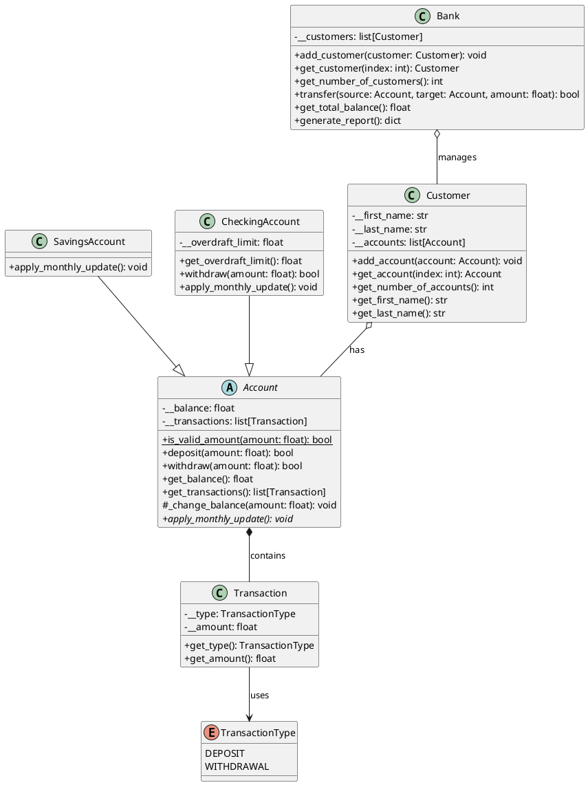

# Banking OOP Python

Projekt zaliczeniowy z programowania obiektowego w Pythonie. Mini-system bankowy pokazujacy kluczowe elementy OOP: dziedziczenie, enkapsulacje, polimorfizm, kompozycje, agregacje i kontrakty.

## Jak uruchomic

Demo:

```bash
PYTHONPATH=src python -m banking
```

Testy:

```bash
PYTHONPATH=src python -m unittest discover -s tests
```

## Struktura repo

```text
banking-oop-python/
├── src/banking/
│   ├── domain.py       # wszystkie klasy domenowe
│   ├── __init__.py     # publiczny interfejs pakietu
│   └── __main__.py     # demo / entry point
├── tests/
│   └── test_banking.py # testy jednostkowe
├── docs/
│   ├── uml/            # diagram klas PlantUML
│   ├── decyzje-architektoniczne.md
│   └── plan-projektu.md
└── examples/           # przyklady tematow pobocznych (wielodziedziczenie, singleton, Protocol)
```

## Model domenowy

<p align="center">
  
</p>

| Klasa             | Rola                                                                      |
| ----------------- | ------------------------------------------------------------------------- |
| `Account`         | Abstrakcyjna klasa bazowa konta. Enkapsuluje saldo i historie transakcji. |
| `SavingsAccount`  | Konto oszczednosciowe. Nalicza miesieczne odsetki (5% rocznie).           |
| `CheckingAccount` | Konto biezace z limitem debetowym. Pobiera miesieczna oplate.             |
| `Transaction`     | Pojedyncza operacja — typ (Enum) i kwota. Kompozycja z Account.           |
| `TransactionType` | Enum: `DEPOSIT` / `WITHDRAWAL`.                                           |
| `Customer`        | Klient przechowujacy liste kont.                                          |
| `Bank`            | Agreguje klientow. Realizuje przelewy i generuje raport sald.             |

## Pokryte tematy OOP

- dziedziczenie i `super()` — `SavingsAccount`, `CheckingAccount` po `Account`
- enkapsulacja — prywatne pola `__balance`, `__customers`, `__transactions`
- polimorfizm — `apply_monthly_update()` dziala inaczej w kazdej klasie konta
- abstrakcyjna klasa bazowa (ABC) — `Account` wymusza implementacje `apply_monthly_update()`
- kompozycja — `Account` zawiera liste obiektow `Transaction`
- agregacja — `Bank` zawiera liste `Customer`, `Customer` zawiera liste `Account`
- Enum — `TransactionType`
- metoda statyczna — `Account.is_valid_amount()`
- kolekcje `list` i `dict` — historia transakcji, lista klientow, raport sald
- wielodziedziczenie i Mixin — `examples/wielodziedziczenie.py`
- singleton (`__new__`) — `examples/singleton.py`
- `typing.Protocol` — `examples/protocol_example.py`

## Testy

```bash
PYTHONPATH=src python -m unittest discover -s tests -v
```

| Klasa testow           | Co weryfikuje                                                 | Liczba testow |
| ---------------------- | ------------------------------------------------------------- | :-----------: |
| `AccountTests`         | wplata i wyplata — warunki poprawne i bledne                  |       3       |
| `SavingsAccountTests`  | saldo poczatkowe, walidacja przy tworzeniu                    |       2       |
| `CheckingAccountTests` | limit debetowy, wyplata w granicach limitu i poza nim         |       6       |
| `CustomerTests`        | przechowywanie wielu kont, dostep po indeksie                 |       1       |
| `BankTests`            | liczenie klientow, przelew, raport sald                       |       6       |
| `TransactionTests`     | historia operacji — typ i kwota transakcji                    |       2       |
| `MonthUpdateTests`     | miesieczne odsetki (SavingsAccount), oplata (CheckingAccount) |       2       |
| `StaticMethodTests`    | walidacja kwoty — metoda statyczna `is_valid_amount`          |       3       |
| **Razem**              |                                                               |    **25**     |
