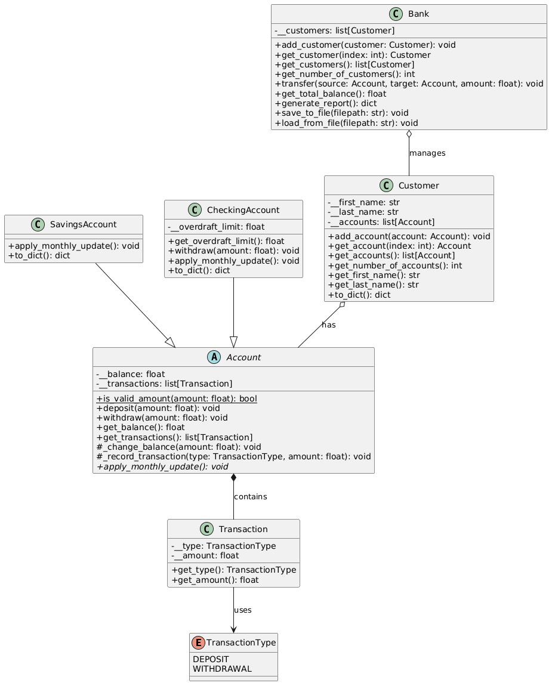

# Banking OOP Python

Projekt zaliczeniowy z programowania obiektowego w Pythonie. Mini-system bankowy pokazujący kluczowe elementy OOP: dziedziczenie, enkapsulację, polimorfizm, kompozycję, agregację i kontrakty. Uzupełniony o zapis/odczyt stanu do pliku JSON, obsługę wyjątków i graficzny interfejs użytkownika (tkinter).

## Wymagania

- Python 3.10 lub nowszy
- Brak zewnętrznych zależności — projekt korzysta wyłącznie z biblioteki standardowej Pythona (`tkinter`, `json`, `abc`, `enum`, `unittest`)

## Jak uruchomić

### 1. Sklonuj repozytorium

```bash
git clone <url-repozytorium>
cd banking-oop-python
```

### 2. Zainstaluj pakiet (jednorazowo)

```bash
pip install -e .
```

To polecenie rejestruje pakiet `banking` w środowisku Pythona. Wymagane tylko raz — po każdej zmianie kodu nie trzeba tego powtarzać.

### 3. Uruchom aplikację

```bash
python -m banking
```

Otworzy się okno graficzne z załadowanymi danymi demonstracyjnymi (dwóch klientów, trzy konta).

### 4. Uruchom testy

```bash
python -m unittest discover -s tests -v
```

Oczekiwany wynik: **33 testy, wszystkie przechodzą (OK)**.

## Struktura repozytorium

```text
banking-oop-python/
├── src/banking/
│   ├── domain.py       # wszystkie klasy domenowe
│   ├── gui.py          # graficzny interfejs użytkownika (tkinter)
│   ├── __init__.py     # publiczny interfejs pakietu
│   └── __main__.py     # entry point — uruchamia GUI
├── tests/
│   └── test_banking.py # testy jednostkowe (33 testy)
├── docs/
│   ├── uml/            # diagram klas PlantUML
│   ├── decyzje-architektoniczne.md
│   └── plan-projektu.md
├── examples/           # przykłady tematów pobocznych (wielodziedziczenie, singleton, Protocol)
├── pyproject.toml      # konfiguracja pakietu
└── requirements.txt    # lista zależności (brak zewnętrznych)
```

## Model domenowy

<p align="center">
  
</p>

| Klasa             | Rola                                                                       |
| ----------------- | -------------------------------------------------------------------------- |
| `Account`         | Abstrakcyjna klasa bazowa konta. Enkapsuluje saldo i historię transakcji.  |
| `SavingsAccount`  | Konto oszczędnościowe. Nalicza miesięczne odsetki (5% rocznie).            |
| `CheckingAccount` | Konto bieżące z limitem debetowym. Pobiera miesięczną opłatę.              |
| `Transaction`     | Pojedyncza operacja — typ (Enum) i kwota. Kompozycja z Account.            |
| `TransactionType` | Enum: `DEPOSIT` / `WITHDRAWAL`.                                            |
| `Customer`        | Klient przechowujący listę kont.                                           |
| `Bank`            | Agreguje klientów. Realizuje przelewy, zapis/odczyt stanu i raport sald.   |
| `BankApp`         | Główne okno GUI (tkinter). Łączy widok z modelem domenowym.                |

## Pokryte tematy OOP

- dziedziczenie i `super()` — `SavingsAccount`, `CheckingAccount` po `Account`
- enkapsulacja — prywatne pola `__balance`, `__customers`, `__transactions`
- polimorfizm — `apply_monthly_update()` działa inaczej w każdej klasie konta
- abstrakcyjna klasa bazowa (ABC) — `Account` wymusza implementację `apply_monthly_update()`
- kompozycja — `Account` zawiera listę obiektów `Transaction`
- agregacja — `Bank` zawiera listę `Customer`, `Customer` zawiera listę `Account`
- Enum — `TransactionType`
- metoda statyczna — `Account.is_valid_amount()`
- metoda chroniona — `Account._record_transaction()` dostępna dla podklas
- kolekcje `list` i `dict` — historia transakcji, lista klientów, raport sald
- obsługa wyjątków — `ValueError`, `FileNotFoundError`, `IOError`, `json.JSONDecodeError`
- serializacja — `to_dict()` w każdej klasie, zapis/odczyt JSON (`save_to_file`, `load_from_file`)
- GUI (tkinter) — `BankApp` dziedziczące po `tk.Tk`, wzorzec MVC (model = `domain.py`, widok = `gui.py`)
- wielodziedziczenie i Mixin — `examples/wielodziedziczenie.py`
- singleton (`__new__`) — `examples/singleton.py`
- `typing.Protocol` — `examples/protocol_example.py`

## Testy

```bash
python -m unittest discover -s tests -v
```

| Klasa testów           | Co weryfikuje                                                        | Liczba testów |
| ---------------------- | -------------------------------------------------------------------- | :-----------: |
| `AccountTests`         | wpłata i wypłata — `ValueError` przy błędnych danych                 |       3       |
| `SavingsAccountTests`  | saldo początkowe, walidacja przy tworzeniu                           |       2       |
| `CheckingAccountTests` | limit debetowy, wypłata w granicach limitu, historia transakcji      |       7       |
| `CustomerTests`        | przechowywanie kont, dostęp po indeksie, `get_accounts()`            |       2       |
| `BankTests`            | liczenie klientów, `get_customers()`, przelew, raport sald           |       6       |
| `TransactionTests`     | historia operacji — typ i kwota transakcji                           |       2       |
| `MonthUpdateTests`     | miesięczne odsetki (`SavingsAccount`), opłata (`CheckingAccount`)    |       2       |
| `StaticMethodTests`    | walidacja kwoty — metoda statyczna `is_valid_amount`                 |       3       |
| `FileIOTests`          | zapis/odczyt JSON, brakujący plik, niepoprawny JSON, brakujące pole  |       6       |
| **Razem**              |                                                                      |    **33**     |
